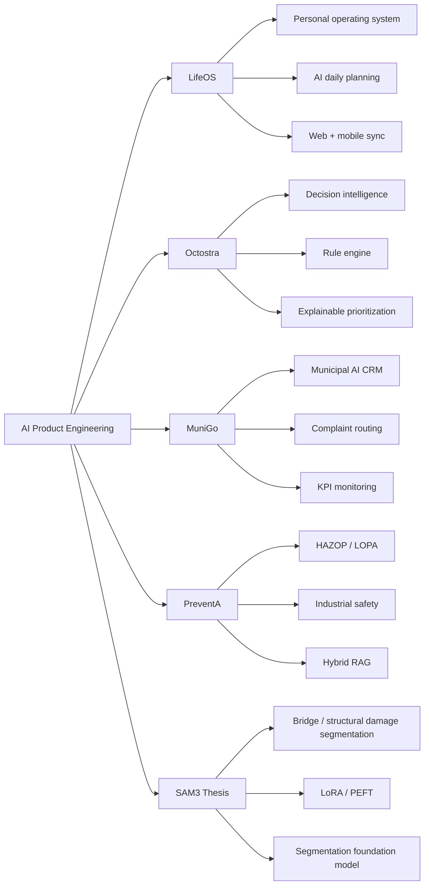

<div align="center">


<br />

<a href="https://tarikdeveci-portfolio.vercel.app/">
  
</a>
<a href="https://www.linkedin.com/in/tarik-deveci/">
  
</a>
<a href="mailto:tariikdevecii@gmail.com">
  
</a>
<a href="https://github.com/tarikdeveci">
  
</a>

<br />
<br />

```txt
AI PRODUCT ENGINEER FROM İZMIR
building real products at the edge of software, intelligence and decision systems
```

</div>

---

## `whoami`

```ts
const tarik = {
  role: "AI Product Engineer",
  location: "İzmir, Türkiye (open to İstanbul + remote)",
  mode: ["builder", "researcher", "product-minded engineer"],
  currentFocus: [
    "SAM3 + LoRA fine-tuning",
    "AI-native productivity systems",
    "decision intelligence",
    "industrial safety software",
    "LLM-powered workflows"
  ],
  philosophy: "AI is not a feature. It is a behavior layer."
}
```

I build products where AI is part of the system’s logic — not just a button next to the search bar.

My work sits between **LLM pipelines**, **decision engines**, **mobile/web products**, and **domain-specific AI systems**.

I care about products that are not only impressive in demos, but useful in real workflows.

---

## Product universe



---

## Current build stack

<table>
<tr>
<td width="50%" valign="top">

### Intelligence layer

```txt
LLM pipelines
Hybrid RAG
Decision engines
LoRA / PEFT fine-tuning
SAM3 / segmentation
GPT API
Hugging Face
PyTorch
PEFT
AWS Polly
```

</td>
<td width="50%" valign="top">

### Product layer

```txt
Next.js
React
TypeScript
React Native / Expo
FastAPI
Django
Spring Boot
PostgreSQL
Supabase
Docker
Vercel
```

</td>
</tr>
</table>

---

## Selected systems

<table>
<tr>
<td width="33%" valign="top">

### LifeOS

Personal operating system for tasks, time blocking, nutrition, workouts and AI daily planning.

```txt
Next.js
React Native
Expo
Supabase
RevenueCat
iyzico
```

`AI productivity` `mobile` `web`

</td>
<td width="33%" valign="top">

### Octostra

Decision-intelligence platform that tells teams what to focus on next — with reasoning.

```txt
FastAPI
PostgreSQL
React
Docker
Rule engine
Scoring layer
```

`decision systems` `explainable logic`

</td>
<td width="33%" valign="top">

### MuniGo

AI municipal call-center and CRM for complaint routing, case tracking and KPI monitoring.

```txt
Django
PostgreSQL
GPT API
AWS Polly
CRM workflows
```

`2 municipalities` `300+ categories` `7s → 1.5s`

</td>
</tr>
</table>

<table>
<tr>
<td width="50%" valign="top">

### PreventA

Process-safety intelligence platform based on HAZOP / LOPA methodology.

```txt
FastAPI
PostgreSQL
React
Hybrid RAG
Industrial safety
```

Built from a real consulting need, not a fake demo idea.

</td>
<td width="50%" valign="top">

### SAM3 + LoRA thesis

Fine-tuning SAM3 with LoRA for bridge/structural damage segmentation on DACL10K.

```txt
SAM3
LoRA
PEFT
PyTorch
Hugging Face
```

Domain: bridge & structural damage segmentation (0.56 mean IoU, 19 classes).

</td>
</tr>
</table>

---

## Impact log

```txt
MuniGo        2 municipalities served
MuniGo        300+ complaint subcategories
MuniGo        7s → 1.5s response latency
MuniGo        ~80% TTS cost reduction
Detay         1,000+ monthly emission records processed
LifeOS        web + mobile AI productivity system
Octostra      explainable decision pipeline, not black-box prioritization
SAM3          bridge/structural damage segmentation (DACL10K), 0.56 mean IoU
```

---

## Architecture taste

I like systems with layers.

```txt
input
  ↓
context
  ↓
reasoning / rules / retrieval
  ↓
decision
  ↓
action
  ↓
feedback loop
```

The boring part is usually where the product becomes real:

```txt
auth
data model
latency
cost
roles
permissions
deployment
monitoring
edge cases
```

That is where I like building.

---

## Tech constellation

<div align="center">


</div>

---

## GitHub telemetry

<div align="center">


</div>

<div align="center">


</div>

---

## Operating principles

```txt
01  Ship the useful version first.
02  Make AI explain itself.
03  Do not build toy demos for real problems.
04  Measure latency, cost and user friction.
05  Good software feels obvious after it exists.
```

---

## Public repositories to explore

```txt
LIFEOS                 AI-native personal operating system
octostra               decision-intelligence platform
AI-Object-Dedection    SAM3 / thesis-side AI research
TicketingSystem        Java / backend system design
Carbonfootprint        sustainability software experiments
```

---

## Elsewhere

<div align="center">

<a href="https://tarikdeveci-portfolio.vercel.app/">
  
</a>

<br />
<br />

```txt
open to AI product engineering roles, software engineering opportunities,
and collaborations around useful AI systems
```

</div>

<div align="center">

### Let’s build something that ships.

</div>


